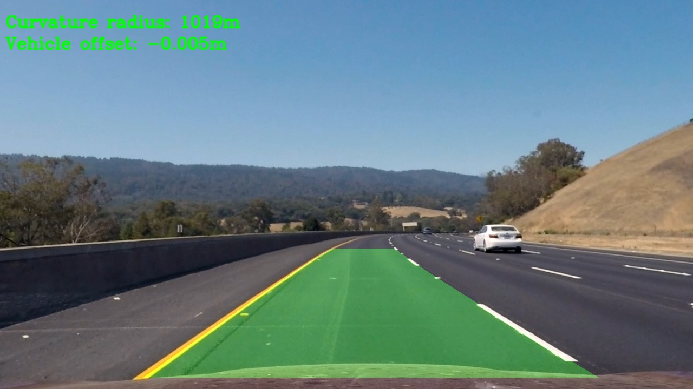

## Advanced Lane Finding
[](http://www.udacity.com/drive)

---
The goals / steps of this project are the following:

* Compute the camera calibration matrix and distortion coefficients given a set of chessboard images.
* Apply a distortion correction to raw images.
* Use color transforms, gradients, etc., to create a thresholded binary image.
* Apply a perspective transform to rectify binary image ("birds-eye view").
* Detect lane pixels and fit to find the lane boundary.
* Determine the curvature of the lane and vehicle position with respect to center.
* Warp the detected lane boundaries back onto the original image.
* Output visual display of the lane boundaries and numerical estimation of lane curvature and vehicle position.

[//]: # (Image References)

[image_calibration]: ./output_images/calibration_output.jpg "Calibration"
[image1]: ./output_images/undistort_output.jpg "Undistorted"
[image2]: ./output_images/gradient_dir.jpg "Gradient Direction"
[image3]: ./output_images/gradient_mag.jpg "Gradient Magnitude"
[image4]: ./output_images/color_binary.jpg "Color Thresholding"
[image5]: ./output_images/abs_sobel.jpg "Abs Sobel"
[image6]: ./output_images/binary_thresholding_full.jpg "Output"
[image7]: ./output_images/warped_image.jpg "Output"
[image8]: ./output_images/fitted_lines_window_with_line.jpg "Sliding window"
[image9]: ./output_images/targeted_search_lines_window_with_line.jpg "Targeted search"
[image10]: ./output_images/final_output_with_info.jpg "Final output"
---

### README
---
#### Structure of the project

There are two .py files that contain relevant logic:

* advance_lane_finding.py - Module which contains all of the image processing functions
* lane_lines.py - Module which contains video pipeline specific logic for handling lane lines

Alongside these modules, there are two files that can be used to test those APIs:

* test_advance_lane_finding.py - Used to test entire logic, does processing on specified video
* test_advance_lane_finding_images.py - Used for testing image processing API on single images

**In order to run project on video, position yourself in project directory and execute test_advance_lane_finding.py**

---
# Pipeline

## 1) Camera Calibration
Function used for camera calibration is located in `advance_lane_finding.py` on line 12.

In this funcion we are trying to map image points detected on image itself by using `cv2.findChessboardCorners()` to object points which represent (x,y,z) coordinates of chessboard corners (real world). Detection of image points can be seen on image bellow.

![alt text][image_calibration]

 After we have found coresponding object points for each image point, we can use that information in order to calculate parameters needed for compensating for distortion in image. These parameters consist of camera model matrix, distortion coefficients (k1, k2, p1, p2, k3), rotation and translation vectors. From these informations, we need model matrix and distortion coefficients for our usecase. These params are written in pickle file so they can be reused later.

## 2) Distortion correction
Distortion correction is important step, since distortion can cause objects in image to appear larger/smaller or less/more curved than they are in reality. 
After applying acquired parameters in calibration step they can be used for distortion correction, and we get following result:

![alt text][image1]

Distortion correction is done with utilzing `cv2.undistort()` function. Distortion correction step is initial step in video pipeline. Distortion correction is done within `undistort_image()` in `advance_lane_finding.py`, line 78.

## 3) Binary thresholding

Next step in pipeline is binary image thresholding. Here, combination of color and gradient thresholding is utilized, in order to achieve as best result as possible
I have choosen to use following combination:

 3.1) Combine gradient magnitude and gradient direction thresholding - with relaitvely close low and high threshold values to get rough outline in both directions (functions `gradient_magnitude_thresholding()`, line 143 `gradient_direction_thresholding()`, line 116). On images bellow outputs from both thresholding functions can be seen in following order: Gradient direction, gradient magnitude

![alt text][image2] ![alt text][image3] 

3.2) Color thresholding - Biggest part of lane lines detections comes from this thresholding, Conversion to HSL color space, where thresholding is done for S component in range (130 - 255). This thresholding is realized in `color_thresholding()`, line 103.
Output of color thresholding function can be seen on image bellow.

![alt text][image4]


3.3) Final thresholding step i have taken is applying one direction sobel operator (Horizontal), in order to detect vertical edges. This thresholding is realized in function `absolute_sobel_thresholding()`, line 82. I have choosen to use single direction sobel operator in order to futher improve detection of vertical edges without introducing unwanted horizontal edges (e.g. Shadows when passing under trees). Output from this function can be seen bellow. It is important to note, that this part of thresholding sagnificantly improves our general output, similar to color thresholding.

![alt text][image5]

3.4) After combining all of the above thresholding techniques we get output shown on image bellow. We can see clearly that lane lanes are visible, which is critical for rest of the pipeline to function properly. Implementation of thresholds combining is realized in function `apply_thresholds()`, line 170.

```python
combined_binary[((mag_binary == 1) & (direction_binary == 1)) |     (color_binary == 1) | (gradient_binary == 1)] = 1
```

![alt text][image6]

It's important to note, that prior to any thresholding, i apply Gaussian blur filter on given image, in order to reduce noise, and make it more friendly for binary thresholding.

## 4.) Perspective Transform

Next step in pipeline is 'chaning perspective to bird's view' step. With this step, it is more clear that lane lines are indeed paralel, atd this step enables us for following pipeline steps, like using sliding window approach for line detection. In order to apply perspective transformation, we first had to acquire transformation matrix with `cv2.getPerspectiveTransform()` function and then use `cv2.warpPerspective()` to do actual transformation. In order to acquire trasnformation matrix, 4 source points (from initial image) that form 'rectangle like' shape must be choosen, but also 4 points in transformed image which are called destination points. Following points were choosen for this transformation:

```python
    point1 = [280, 700]
    point2 = [595, 460]
    point3 = [725, 460]
    point4 = [1125, 700]
    source = np.float32([point1, point2, point3, point4])

    dest_point1 = [250, 720]
    dest_point2 = [250, 0]
    dest_point3 = [1065, 0]
    dest_point4 = [1065, 720]
    destination = np.float32([dest_point1, dest_point2, dest_point3, dest_point4])
```

Perspective transformation is realized in `go_to_birdview_perspective()` function, line 203. On image bellow, output from perspective transformation function is given.

![alt text][image7]

Note: Source and destination points for perspective transformation were indentified with gimp tool.

## 5.) Lane lines detection

After perspective transformation, we are able to identify lane lines on our transformed frame. For this, sliding window approach is used. 

General explanation for sliding window algorithm:

1. Calculate histogram of lower bottom of image, in order to identify places where lane line start (Histogram values are highest) and these coordinates are used as starting point for our search - base position
2. Place window on on current base position and identify all non-zero pixels in that window
3. Count all non-zero pixels
4. If number of non zero pixels is greater than given threshold, update base position on which next window will be placed
5. Append coordinates of non-zero pixels to one of the lists (for left or right lane line)
6. Repeat steps 2 - 5 for all windows
7. Once all windows are processed, we have two lists of pixels that represent left and right lane line

This algorithm is used for blind search of lane lines and it is used in case when we don't have previous knowledge about where the lane lines are. Algorithm is implemented in `find_lane_pixels()`, line 242. Output of algorithm is shown on image bellow.

![alt text][image8]

Yellow lines in above image repressent curve fitted through set of pixels which denotes each of the lines using numpy curve fitting function `np.polyfit()`. Second degree polynomial is used here. Red line denotes left lane line pixels, and blue denotes right lane line pixels.

After we have detected lane lines, in following frame, we do not have to execute blind search, but we can use highly-targeted search. This algorithm is implemented in function `targeted_search()`, line 355. Idea here is that we save time in our search, since we have knowledge about priors line position, and we can use this information, and just search the area near previous line detection, since line position does not vary extremly between two consecutive frames. Output from this function can be seen on image bellow.

![alt text][image9]

White lines denote curve fitted through detected points that belong to lane line. Targeted search is used in case when pipeline is used to process video input and here we reuse lane location from previous frame

## 6.) Curvature radius and vehicle offset

After we have fitted polynomial through pixels that denote lane line position, we can use this poly in order to calculate lane curvature radius and vehicle's offset from middle of the lane. If we have equation of second degree poly, we can derive following equation which is used to calculate curvature's radius:

```
R = [(1 + (dx / dy)^2)^1.5] / abs[d^2x / dy^2]
```
which in our cases becomes:
```python
curvature = ((1 + (2 * curve_fit[0] * y_eval * ym_per_pix + curve_fit[1]) ** 2) ** (3 / 2)) / np.absolute(2 * curve_fit[0])
```

where `curve_fit` denotes curve parameters and y_eval denotes position on y axis for which we calculate curvature radius.

Radius curvature calculation is realized in `measure_curvature()`, line 399. It is important to note, that we need to apply certain scaling factor in order to go from pixel space to real world measurements. Based on traffic regulation, we know that lane width is aproximately 3.7m wide and that dashed line segments are around 3m long each. From this we can come up with approximate scale factors for our calculations:

* In y direction, we have 30 / 720 meters per pixel
* In x direction, we have 3.7 / 700 meters per pixel

Once we fit our polynomial in scaled axises, and use mentioned formula we can calculate curvature of left and right lane line. These two values can be averaged in order to aproximate  lane curvature.

In order to calculate vehicle offset from middle of the lane, we just need to measure difference between middle of the image and middle between lane lines for given y value. We start by calculating x postion for left and right lane line for same y, and then we calculate mean for x positions and we assume that this point represents middle of the lane. After that we just subtract this value from actual middle of the given frame (width / 2) and result is scaled with by 3.7 / 700 which represents pixel to meter ratio in x direction. This functionality is realized in `calculate_vehicle_offset()`, line 418.

## 7.) Final result

After previously explained pipeline is applied on image, and additional curvature and vehicle's offset information is embedded to image, we get following output:

![alt text][image10]

Pipeline functionality is implemented in `lane_lines.py` module as `run()` method of `LaneFinder` class. This class is used to abstract `advance_lane_finding.py` module and create simple wraper around it.

`LaneFinder` class also handles lane lines detection logic, and can distinguish between case where lane line is detected and when it is not. Initally, both lane lines are not detected, so in this case, blind search is preformed, but for next frame we can perform targeted search, since we know lane line location.

Once detection is made, we average our current poly with values from 2 previous iterations (frames) in order to reduce jittering.

Here's a [link to my video result](https://youtu.be/RKMXYW0pSlE)

---

## Discussion

One of most obvious pipeline weaknesess are more sagnificant shadows present on the road. This can be seen in project video at [0:39](https://youtu.be/RKMXYW0pSlE?t=39) in form of slight right line 'wiggle'. This problem could potentialy be solved with reducing width of sliding window (margin) or using more previous values for averaging of detected lane line.

Additional scenario where pipeline fails is challenge video, since there are additional lines on lane present, such as asphalt cracks but also more intense shadows on the road - (section when vehicle is passing under the bridge). One potential solution of preventing asphalt irregularities is to somehow reduce search area (Region of interes). One idea i had was to try to implement some kind of adaptive ROI Filter which follows lane tries to mimic lane lines curvature, but changes over time according to change of lane lines and also covers wider area around the lane, but tries to mask out shadows present at side of the road. Other possiblity would be to make bigger threshold when declaring lane line as detected (more sensitive) and then perform blind searches more frequently, but when creating histogram to find start of lane lines, perform some kind of masking in uninteresting ares, so we increase our chance of detecting lane line start. With more narrow sliding windows, we would have less chance of missing our line.

Problems that come from shadows on the road could possibly be solved with different thresholding approach. (e.g. experiment with different color spaces etc.).

Additional improvements could also include implementing some kind of sanity-checker which compares current lane line fit with previous fits, and if difference between two are drastic, discards this as false detection.